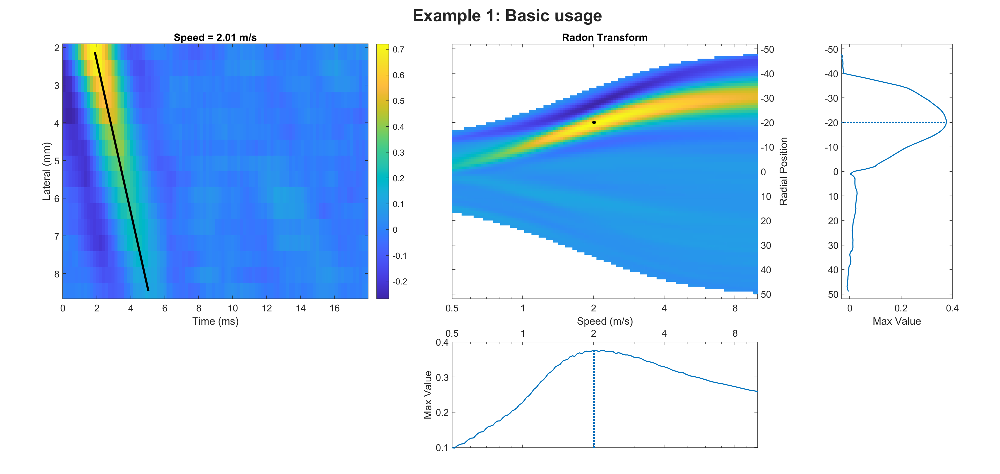
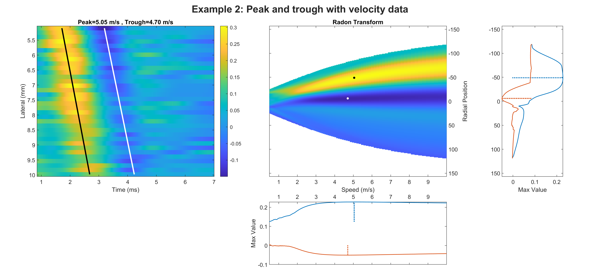
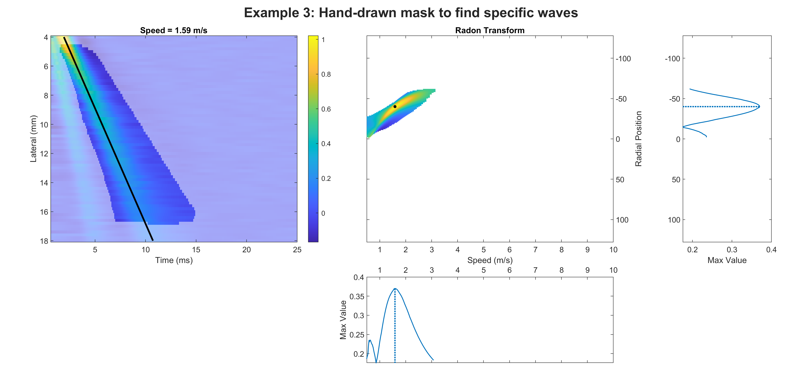
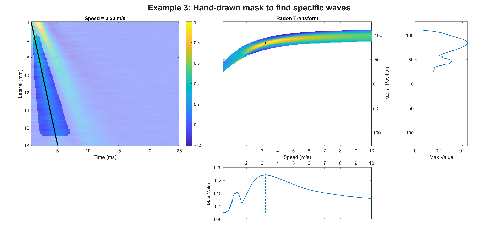
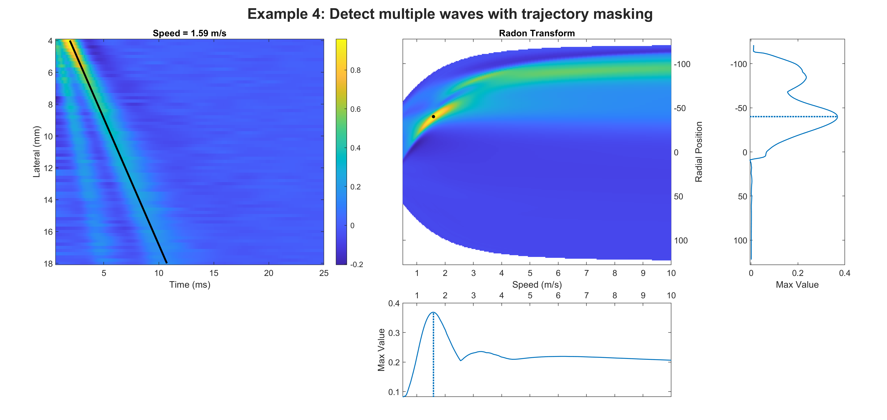
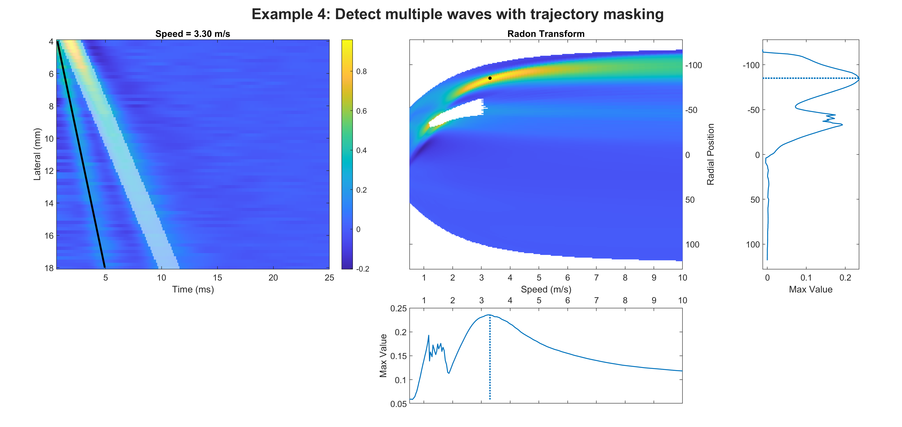

# Radon transform wave-speed estimator
This package contains MATLAB scripts that use the Radon transform to find the wave speed and trajectory from spatiotemporal particle motion data.
This code was developed for processing ultrasound shear wave elasticity imaging data (SWE/SWEI).

The Radon transform calculates the line integral of 2D data over all possible trajectories.
The slope of the trajectory that maximizes the Radon transform is the group speed of the wavefront.

Features of this package:
* Adjustable speed range and resolution
* The normalized Radon transform accounts for trajectory length
* Wave strength metric equal to the data averaged along the trajectory
* Apply arbitrary data masks, with helper scripts to make various masks, including hand-drawn masks

## Examples
Refer to the example scripts to see how this package is used:

Example 1: Basic usage

Example 2: Find speeds of peak and trough in particle velocity data

Example 3: Hand-drawn masks

Example 4: Detect multiple waves with trajectory masking

## How to use
0. Load and pre-process your spatiotemporal particle motion data
1. Create a data struct with `MakeDataStruct`
2. Use `CalcTheta` to generate a speed search range 
3. Use `NormRadon` to perform the normalized Radon transform, with optional masking (see notes) 
4. Use `FindRadonPeaks` to find the transform's peak
5. Use `CalcTrajectory` to calculate the wave speed and trajectory.
   * (optional) `CalcResolution` estimates the resolution for the output speed
6. Visualize results with `PlotRadon`

## Notes
* `MakeDataStruct` requires three quantities: a 2D array of spatiotemporal data and the corresponding vectors for spatial and temporal coordinates.
* Common pre-processing steps (not required): filtering, resampling, differentiating in time, cropping, normalizing in time at each spatial location, etc.
* `CalcTheta` may be passed a specific list of discrete wave speeds to search.
By default, it constructs a logarithmically-spaced speed range.
* `NormRadon` may be passed a mask to apply it to the input data. This package contains the following helper scripts to generate useful masks:
  * `MaskManual`: the user manually circles the desired wave and the drawing is used as a mask. This is particularly useful for data with multiple waves or to avoid artifacts.
  * `MaskTrajectory` uses the inverse Radon transform to mask out a specified trajectory
  * `MaskSpeed` creates a speed-based mask to isolate data faster or slower than a specified speed

## Citing
If you use this package in your work, please cite the Zenodo DOI.

## License
Copyright 2022 Felix Q. Jin

Licensed under the Apache License, Version 2.0 (the "License");
you may not use this file except in compliance with the License.
You may obtain a copy of the License at

   http://www.apache.org/licenses/LICENSE-2.0

Unless required by applicable law or agreed to in writing, software
distributed under the License is distributed on an "AS IS" BASIS,
WITHOUT WARRANTIES OR CONDITIONS OF ANY KIND, either express or implied.
See the License for the specific language governing permissions and
limitations under the License.